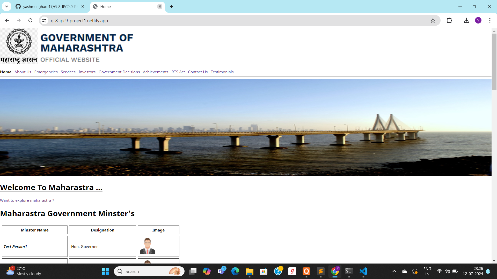
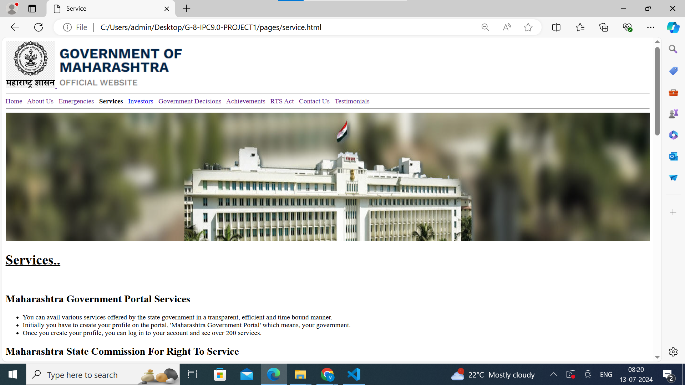

# Government Of Maharastra #

Welcome to **Government Of Maharastra Website !** 

This is open-source **dummy project i.e (just for practice)**
serves as information about maharastra government like
Scheme,Acheviments,Decisions and many more etc.

Website URL : [visit our website](https://g-8-ipc9-project1.netlify.app/)

We have various pages in this websites are as follows :

- **Home**
- **About Us**
- **Emergencies**
- **Services**
- **Investors**
- **Goverment Decisions**
- **Achivements**
- **RTS Act**
- **Contact Us**
- **Testimonials**

## **Home Page** ##

## Information About Home Page ##
- **Page Link** : [Visit Home Page](https://g-8-ipc9-project1.netlify.app/) .
- **Summery Of Page** : This is an Home Page. This is an main entry page of our website.
This page content information about Govt Of Maharasta Ministry,information about maharastra state,
Govt Maha scheme,videos about top cities ,pdf and enquire form etc.
- **Language Used** : HTML 5

## **Service Page** ##

## Information about service page ##
- **Page Link** : [Visit Service Page](https://g-8-ipc9-project1.netlify.app/) .
- **Summery Of Page** : This is an Service Page.This page content information about Govt of Maharashtra Portal services, Maharashtra state commission for right to service, Employees groups and vacant seat, pdf of services online registration,service office maps and create profile etc .

## About Contribute ##
This is an open source project so that you can also improve this project.
Follow below step for contribute :
1. Fork the repo (Repository) .
2. Then clone the repo (Repository) in your windows .
3. Then make changes you want and send the pull request .
4. When your pull request accept then synk the fork .
5. After that synk get pull in your editor .

